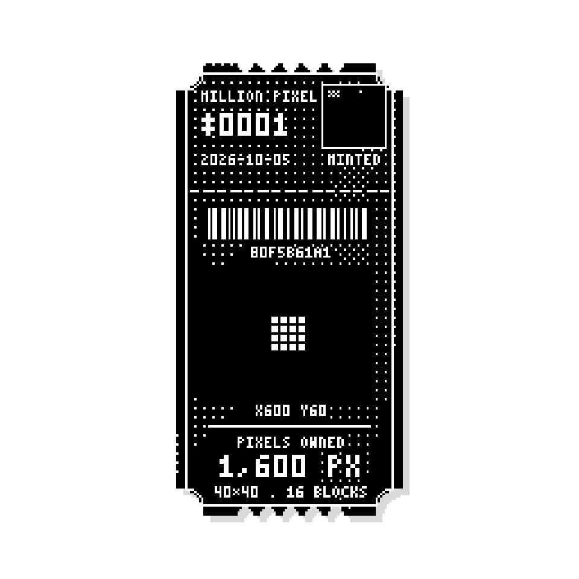

# The Million Pixel Homepage

A 1,000,000-pixel grid on **Robinhood Chain**, inspired by the original Million Dollar Homepage (2005).
People connect a wallet, select free 10×10 blocks at **$1 per block**, and receive a square
pixel-art **deed NFT** as proof they own that plot.

Follow: [@MillPixels](https://x.com/MillPixels)



## How it works

1. Connect a wallet. The site asks it to switch to Robinhood Chain (chain ID 4663).
2. Drag on the grid to select empty blocks. A preview of the deed appears.
3. Pick a plot colour. Image, hover text and link are optional and can be added later.
4. Sign. The plot appears on the grid and the deed is shown.
5. The wallet holding the deed can edit the ad at any time.

One mint gives one deed covering the whole plot, however many blocks it has.

## The deed NFT

- Generated only from the plot's coordinates, so it can be redrawn exactly at any time.
- 256×256 PNG, black-and-white pixel art, ticket inside a square frame. Scales cleanly by whole numbers.
- Shows the deed number, mint date, a mini-map of the grid, a barcode, the plot's block shape,
  its position, and the total pixels owned.

## Status

**Demo.** Purchases are signed by the wallet but **no funds move**.
Hosted on its own (this repo), plots are saved in the visitor's browser only.

Still to build:

- [ ] Sale contract on Robinhood Chain: takes payment, mints the deed NFT, rejects overlapping plots
- [ ] Indexer that reads contract events and serves the shared grid
- [ ] Deed image generator on the server for NFT metadata
- [ ] Moderation: hide images and links on the site without touching the NFT

## Run locally

It's a single static file. Open `index.html`, or serve the folder:

```
npx serve .
```

## Network

| | |
|---|---|
| Chain | Robinhood Chain mainnet |
| Chain ID | 4663 (`0x1237`) |
| RPC | https://rpc.mainnet.chain.robinhood.com |
| Explorer | https://robinhoodchain.blockscout.com |
| Gas | ETH |

## Docs

- [Business model](docs/business-model.docx). Written before the price changed to $1 per block, so its revenue figures are out of date.
